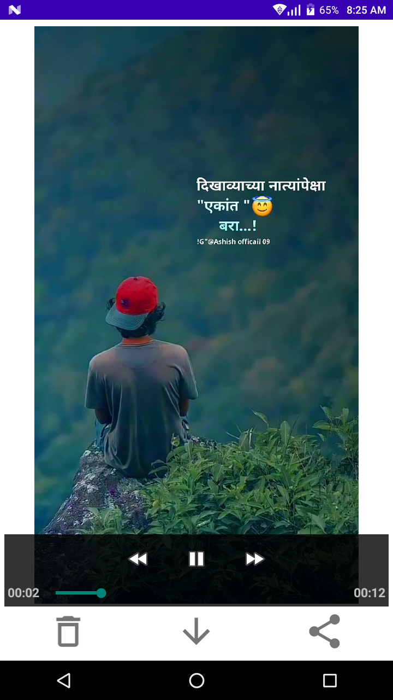

# status_downloader
---------------------
This app contains fetures of to download whatsapp status very easyily way. This app used for personoal use and educational purpose

 &emsp; &emsp;    &emsp; &emsp; 
 

 &emsp; &emsp;    &emsp; &emsp; 
 

 &emsp; &emsp; 

#Features
---------------------
~see whatsapp status in app  
~Share whatsapp status 
~Download Whatsapp status 
~Delete status from app 

#Benefits
---------------------
~Very responsive design and UI 
~Easy to use
